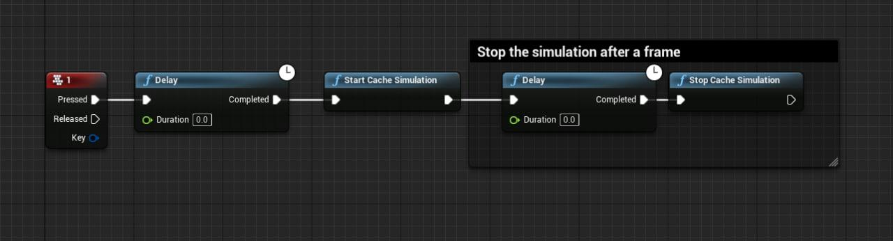

# Insomniac Games CacheSim plugin for UE4
This plugin for Unreal Engine 4 lets you use the Insomniac Games Cache Simulation tool to detect cache misses in your games.

CacheSim is a cache simulator developed by Insomniac Games. In its current form it simulates an AMD Jaguar cache configuration.

For more information on how CacheSim was developed and how it works internally,
you can check out [this GDC 2017 slide deck](https://deplinenoise.wordpress.com/2017/03/02/slides-insomniac-games-cachesim/).

The talk is available on the GDC vault with full video as well.

## How to use

1. Copy the *Plugins* folder to your project.
2. Open your project.
3. Enable the plugin in the Plugins window.
4. Add the following code to any Blueprint (the player controller or the level Blueprint are good candidates for this).

5. Make a build of your game in any configuration you want and make sure you include the debug symbols with it.
6. Open the packaged game and press the key you set up before. The game should freeze for a bit.
7. Open the *CacheSimUI-x64-Release/CacheSimUI.exe* binary included in this repo or compile it yourself from the [ig-cachesim](https://github.com/Tonire/ig-cachesim) repo.
8. Open the report that has been generated next to the game's executable.

## Known issues
Do not use it inside the editor. It will most likely crash.

Debbugers get really confused if you try capture when they are attached to the process. Solution: Run detached!

Third Party Software
-------
CacheSim has the following license

    Copyright (c) 2017, Insomniac Games All rights reserved.

    Redistribution and use in source and binary forms, with or without
    modification, are permitted provided that the following conditions are met:

    Redistributions of source code must retain the above copyright notice, this
    list of conditions and the following disclaimer.

    Redistributions in binary form must reproduce the above copyright notice, this
    list of conditions and the following disclaimer in the documentation and/or
    other materials provided with the distribution.

    THIS SOFTWARE IS PROVIDED BY THE COPYRIGHT HOLDERS AND CONTRIBUTORS "AS IS" AND
    ANY EXPRESS OR IMPLIED WARRANTIES, INCLUDING, BUT NOT LIMITED TO, THE IMPLIED
    WARRANTIES OF MERCHANTABILITY AND FITNESS FOR A PARTICULAR PURPOSE ARE
    DISCLAIMED. IN NO EVENT SHALL THE COPYRIGHT HOLDER OR CONTRIBUTORS BE LIABLE
    FOR ANY DIRECT, INDIRECT, INCIDENTAL, SPECIAL, EXEMPLARY, OR CONSEQUENTIAL
    DAMAGES (INCLUDING, BUT NOT LIMITED TO, PROCUREMENT OF SUBSTITUTE GOODS OR
    SERVICES; LOSS OF USE, DATA, OR PROFITS; OR BUSINESS INTERRUPTION) HOWEVER
    CAUSED AND ON ANY THEORY OF LIABILITY, WHETHER IN CONTRACT, STRICT LIABILITY,
    OR TORT (INCLUDING NEGLIGENCE OR OTHERWISE) ARISING IN ANY WAY OUT OF THE USE
    OF THIS SOFTWARE, EVEN IF ADVISED OF THE POSSIBILITY OF SUCH DAMAGE.